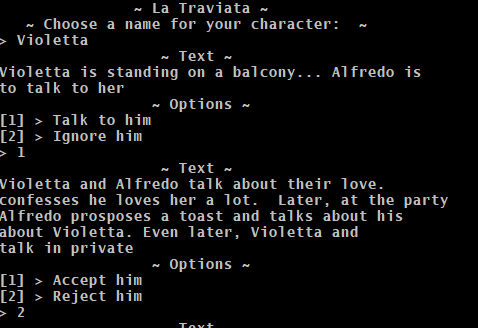

### La Traviata, Text adventure port



#### About
Connect to a MySQL server (127.0.0.1) with username ```root```, no password.
SQL dump: la_traviata.sql

#### Dependencies
All located in /lib
    * json.jar
    * mysql-connector-java-8.0.15.jar

#### Build it

```javac -cp lib/json.jar;lib/mysql-connector-java-8.0.15.jar src/*.java```
Should work, but doesn't. Only able to build from IDE.

#### Run it
```java -jar builds/la-traviata-java.jar```
